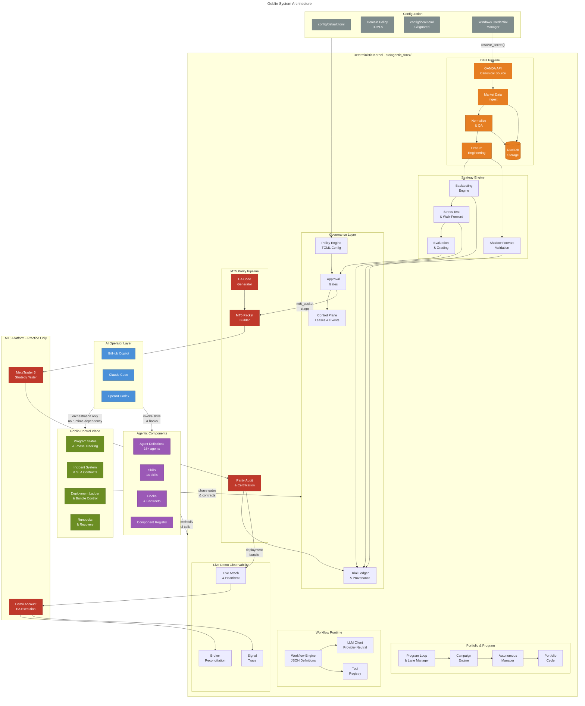

# Goblin System Architecture

Visual architecture diagrams for the Goblin algorithmic forex research platform.

---

## System Overview



### Layer Descriptions

| Layer | Location | Role |
|-------|----------|------|
| **AI Operator** | External (Copilot, Claude, Codex) | Advisory orchestration — no runtime dependency |
| **Control Plane** | `Goblin/` | Program phases, incidents, deployment bundles, runbooks |
| **Agentic Components** | `.agents/` | Agent definitions, skills, hooks, registry |
| **Deterministic Kernel** | `src/agentic_forex/` | All research, evaluation, governance, and trading logic |
| **Configuration** | `config/` | TOML policy files, local overrides (gitignored), secrets |
| **MT5 Platform** | External | Practice/parity validation only — never research truth |

---

## Strategy Deployment Ladder

Every strategy candidate progresses through governed stages. No stage can be skipped.

```mermaid
---
title: Strategy Deployment Ladder
---
flowchart LR
    Discovery["Discovery\n& Hypothesis"]
    Backtest["Backtest\n& Stress Test"]
    Robustness["Robustness\nReview"]
    Forward["Shadow Forward\nValidation"]
    MT5Parity["MT5 Parity\nCertification"]
    Shadow["Shadow-Only\nDemo Week"]
    LimitedDemo["Limited Demo\nActive Trading"]
    ObservedDemo["Observed Demo\nFull Monitoring"]
    ChallengerDemo["Challenger Demo\nBenchmark Race"]
    Eligible["Eligible for\nReplacement"]

    Discovery --> Backtest --> Robustness --> Forward
    Forward --> MT5Parity --> Shadow --> LimitedDemo
    LimitedDemo --> ObservedDemo --> ChallengerDemo --> Eligible

    classDef research fill:#3498db,stroke:#2471a3,color:#fff
    classDef governance fill:#f39c12,stroke:#d68910,color:#fff
    classDef demo fill:#27ae60,stroke:#1e8449,color:#fff
    classDef final fill:#8e44ad,stroke:#6c3483,color:#fff

    class Discovery,Backtest research
    class Robustness,Forward,MT5Parity governance
    class Shadow,LimitedDemo,ObservedDemo demo
    class ChallengerDemo,Eligible final
```



| Stage | Gate Type | Evidence Required |
|-------|-----------|-------------------|
| Discovery | Automated | Strategy hypothesis + rationale card |
| Backtest | Automated | Trade count, profit factor, expectancy thresholds |
| Robustness | Automated | Walk-forward, stress test, deflated Sharpe |
| Shadow Forward | Automated | Out-of-sample validation on recent OANDA data |
| MT5 Parity | Automated + Human | EA compilation, parity audit, certification report |
| Shadow Demo | Operational | 1-week shadow mode — signals only, zero orders |
| Limited Demo | Operational | Active demo trading with full observability |
| Observed Demo | Operational | Extended monitoring period with broker reconciliation |
| Challenger Demo | Human | Head-to-head vs. locked benchmark |
| Eligible | Human | Final promotion decision with statistical evidence |

---

## Four-Channel Truth Stack

Goblin uses four independent evidence channels. Each adjacent pair has a specific comparison enforcement level.


| Channel Pair | Enforcement | Decision Scope |
|-------------|-------------|----------------|
| Research ↔ MT5 | Structural consistency | Research-to-executable validation |
| MT5 ↔ Live Demo | Strict executable parity | Deployment-grade validation |
| Live Demo ↔ Broker | Strict reconciliation | Operational and financial reconciliation |

**Key rule:** MT5 evidence can explain failures but cannot establish promotion truth. OANDA research is the canonical data source.

---

## Directory Map

```
├── .agents/           # Canonical agentic components
│   ├── agents/        #   Agent definitions (16+)
│   ├── skills/        #   Skill definitions (14)
│   ├── hooks/         #   Hook contracts
│   └── registry.json  #   Component registry
├── src/
│   ├── agentic_forex/ # Deterministic kernel (24 subpackages)
│   └── goblin/        # Bridge namespace (sys.modules aliasing)
├── Goblin/            # Program control plane
│   ├── STATUS.md      #   Current phase state
│   ├── contracts/     #   Governance contracts
│   ├── checkpoints/   #   Phase completion evidence
│   └── runbooks/      #   Operational runbooks
├── config/            # TOML policy files
├── workflows/         # JSON workflow definitions
├── approvals/         # Approval log + MT5 packets/runs
├── experiments/       # Trial ledger + campaign data
└── docs/              # Architecture + governance docs
```
